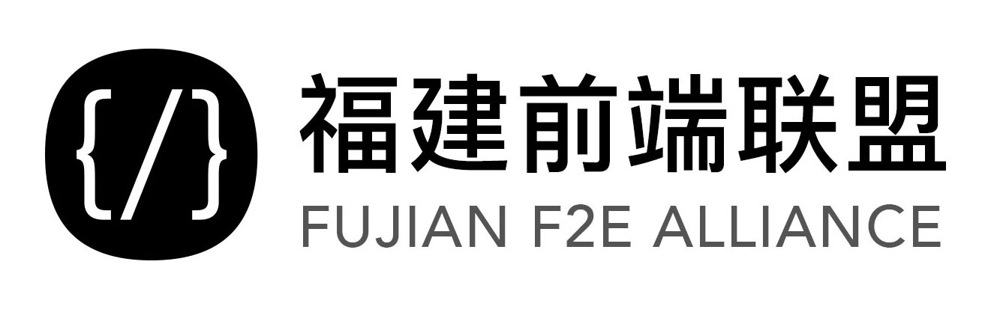

## 始于 2012 年 5 月 16 日

> 有什么问题，想说的请提 issue。

### 第 31 期 分享话题收集中

- [Any Suite-查理大叔](./s31/AnySuite.pptx)
- [资源-查理大叔](https://github.com/futurechallenger/any_suite)
- [聊聊 REACT 组件设计-黄如鑫](./s31/前端分享第31期短分享-聊聊React组件.zip)
-

#### 第 30 期资料

- [使用 Lerna 拆分 JS 工程-幸运猴子](./s30/使用Lerna拆分JS工程.key)
- [使用 Lerna 拆分 JS 工程-demo-幸运猴子](./s30/scaffold.zip)
- [hexo 快速搭建博客-冯超颖](./s30/冯超颖hexo.key)

#### 第 29 期资料

- [如何给程序员看病-林朕威](./s29/如何给程序看病.zip)
- [利用 NodeJS 开发 CLI-linweiwei](https://slides.com/weiweilin/deck-4#/)

#### 第 28 期资料

- [VUE 开发技巧-林小波](./s28/VUE开发技巧.pptx)
- [web3D-Guowc](./s28/Guowc-web3D.key)
- [web3D-demo-Guowc](./s28/web3D-demo.zip)

#### 第 27 期资料

- [RxJS 的异步新世界-demo-雪碧](https://github.com/doodlewind/rx-elevator-demo/)
- [RxJS 的异步新世界-ppt-雪碧](./s27/rx-intro.pdf)

#### 第 26 期资料

- [前端异常监控-昝涛](./s26/前端异常监控_stefanzan@fundebug.pdf)
